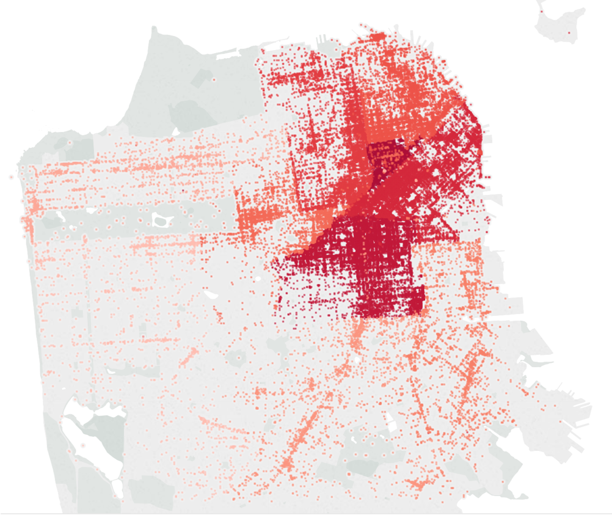
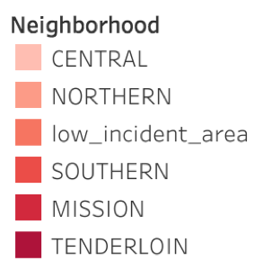

# Forecasting San Francisco's Homeless Crisis 

Harmeet Hora
Project Kojak
Metis Summer Cohort 2018

## Description:

After recently moving back to the Bay Area, the issue that immediatley stood out to me was how bad the homeless crisis has gotten. This inspired me to use the power of predictive analytics to forecast how the crisis will look in the future, as well as suggest some data driven strategies to medicate cost while maintaing social services for indviduals in this extremeley unfortunate situation

## Project Design: 

To find data on this topic, I went over to [Data SF](https://datasf.org/opendata), which is an excellent resource for open data about San Francisco. The most relevant dataset to the issue of homelessness was the history of 311 calls reported by citizens. These calls are tagged with a complaint type, which allowed me to only select records with the 'Homeless Concerns' tag along with a corresponding Case id.

This ended up being around 158k records over a 10 year period (2008 to 2018). Using this timestamped data, my plan of attack was to use time series modeling to forecast number of reported homeless cases per day by neighborhood. The idea behind forecasting number of incidents was to allow the city of San Francisco to optimize on resource allocation, as well as determine ideal locations for homeless outeach.

## Tools:

- Pandas
- Matplotlib
- GridSearchCV
- Sklearn
- Seaborn
- ARIMA Forecasting
- Linear Regression Models
- Facebook Prophet Package

I tried multiple methods of forecasting in order to minimize my mean absolute error, which was the main metric I used to gauage performance for my models.

## Data:

The data was 158k records of 311 calls over 10 years that contained geotagged locations, as well as specific type of concern (ex: human waste, encampments etc). The geotagged locations allowed me to easily leverage Tableau to make an interactive graph of all the incidents across the city.

Originally, there were 10 distinct police districts (neighborhoods) with data. As seen below, many of the police districts had a sparse amount of data. This made predicting accuratley very difficult, as low instances of cases were occuring on my days. This makes any prediction have the tendency to off by quite a large marigin.

In order to deal with this issue, I decided to combine the 5 lowest volume neighborhoods into one 'low income area'. The neighborhoods I combined were

1. Tarval
2. Richmond
3. Ingleside
4. Bayview
5. Park

Below is the result map.

## Algorithims:

I used a variety of different time series and regression algorithims for this project. They are listed below:

- ARIMA Time series forecasting
- SARIMA 
- Facebook Prophet
- OLS
- Random forest regression
- Gradient booster regression
- Decsision tree regression

Below were the highest rated algorithm by neighborhood that I forecasted cases for. With a mean absolute error ranging fro 1.46 to 2.91, the models can reasonably predict the number of cases by day per neighborhood.

| Neighborhood | Best Model    | Mean of test set | MAE  | % of Incidents |
| ------------ | ------------- | ---------------- | ---- | -------------- |
| Tenderloin   | ARIMA (6,1,7) | 15.4             | 2.35 | 24%            |
| Mission      | ARIMA(14,1,2) | 22.6             | 2.91 | 23%            |
| Southern     | Random Forest | 24               | 2.75 | 21%            |
| LIA          | Random Forest | 17.8             | 1.93 | 13%            |
| Central      | OLS           | 14.6             | 1.46 | 10%            |
| Northern     | Random Forest | 14.2             | 1.57 | 9%             |

## What I would do differently:

If I were to reattack this problem, I would try to incorporate more features in the data, such as the type of incident. The idea behind this is that instead of just forecasting number of incidents, I would be able to forecast exactly what the city needs would be in the future based off of the action needed to resolve each incident.

I would also want to incorporate another dataset into the analysis. I did obtain a dataset for police incidents in SF. I would like to somehow be able to tie criminal incidents with homeless incidents and note if there was any correlation with certain types of crimes (ex: trespassing)